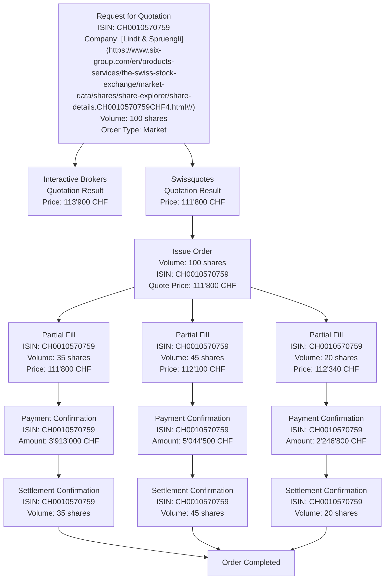

## Mermaid Diagram of distributed Shares Purchasing

The event cascade should mimick a distributed shares purchasing process with the following steps:

1. Issue a request for quotation to two stock broker systems - Swissquotes and Interactive Brokers - for the market order purchasing of 100 shares of Lindt and Spruengli shares. In the root event box list the ISIN, the name of the company, the volume and the type of order (market or limit order)
2. From Swissquotes receive a 10% higher price in the quotation result and from Interactive Brokers the currently valid price approximation (does not need to be accurate). Amend the information in the relevant box with the prices. 
3. Continue only the Interactive Broker stream further in the mermaid diagram as follows:
    a. Issue an order for 150 shares of Lindt and Spruengli
    b. Receive a set of three partial fills for the order
        i. one with 35 shares at the original price
        ii. a second one with 45 shares at a slightly higher price
        iii. a third with 20 shares at yet a slightly higher price
4. Receive a payment confirmation for each of the three partial fills
5. Receive a settlement confirmation for the shares for each of the three partial fills

